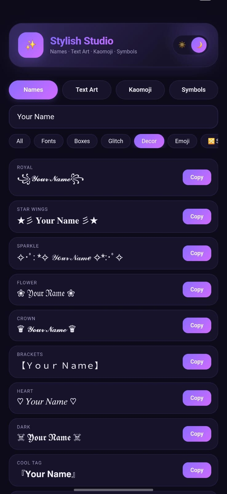
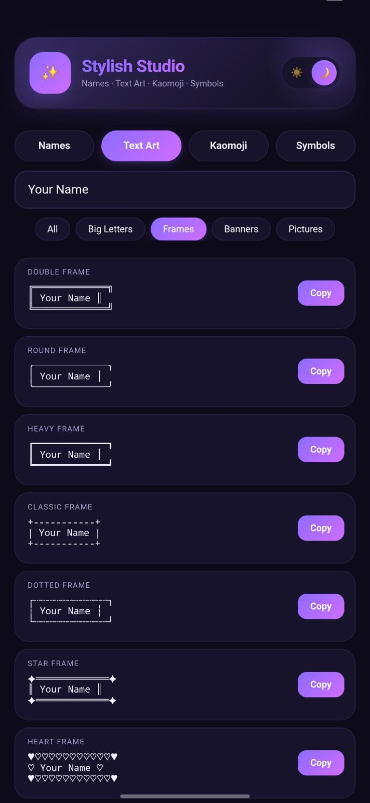
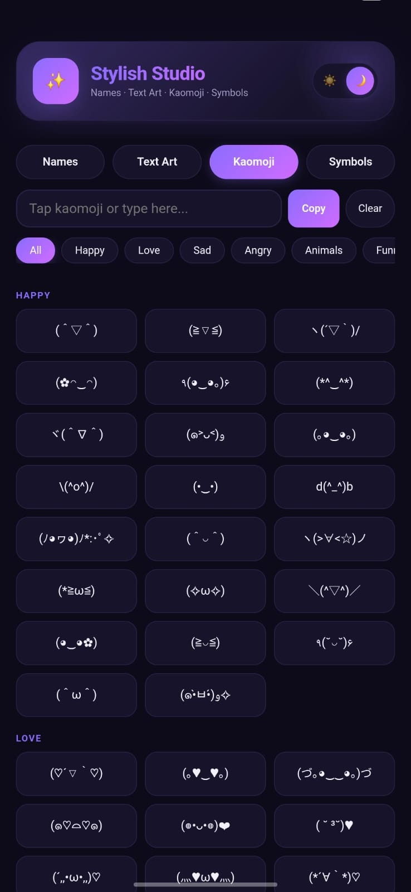
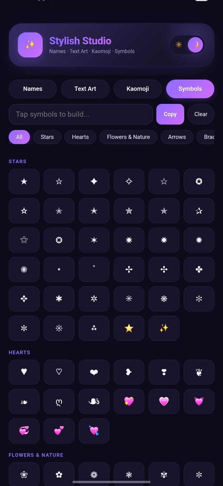

# ✨ Fancy Text Generator ✨

  ✨ <b>Create • Copy • Share</b> ✨

---

## 🌙 About

A fun little **hobby project** created for anyone who loves turning ordinary text into something ✨ unique ✨.

> 𝙏𝙪𝙧𝙣 𝙨𝙞𝙢𝙥𝙡𝙚 𝙬𝙤𝙧𝙙𝙨 𝙞𝙣𝙩𝙤 𝙨𝙤𝙢𝙚𝙩𝙝𝙞𝙣𝙜 𝙛𝙖𝙣𝙘𝙮 ♡

## ✨ Features

* 𝓕𝓪𝓷𝓬𝔂 𝓣𝓮𝔁𝓽
* ꧁༺ Symbols ༻꧂
* (づ｡◕‿‿◕｡)づ Kaomoji
* ╰┈➤ Text Art
* ★ Special Characters ★
* ♡ Cute & Aesthetic Styles ♡
* 📋 Easy Copy
* 🎨 Creative text styles

## 🚀 How It Works

**Type → Choose → Copy → Share**

Create your style, copy it instantly, and use it anywhere — chats, bios, captions, usernames, social media, and more. ✨

## 📱 Screenshots

  
  

  
  

## 🛠️ Project

This is my **second application**, created as a personal hobby project to learn, experiment, and have fun building something creative.

### 👨‍💻 Developer

 # Developed BY Samiru Ninduwara
 
Created with ❤️ as a personal hobby project.

* 💡 Idea & Concept — **Samiru Ninduwara**
* 🎨 Design & UI — **Samiru Ninduwara**
* 💻 Development — **Samiru Ninduwara**
* 🧪 Testing & Improvements — **Samiru Ninduwara**

### 🙏 Special Thanks

Thanks to everyone who inspired, tested, suggested ideas, or helped make this little project possible. ✨

And a special thanks to the amazing open-source community for the tools, resources, and inspiration that make projects like this possible. 🌐

---

## 📜 License

This project is created for learning and personal/hobby purposes.

Please check the repository license for the exact usage and distribution terms.

---

**💜 Made with creativity & curiosity**

**🛠️ Built as a hobby project**

**✨ Simple • Fun • Creative**

 

> “Normal text is boring. Make it ✨ yours ✨”

